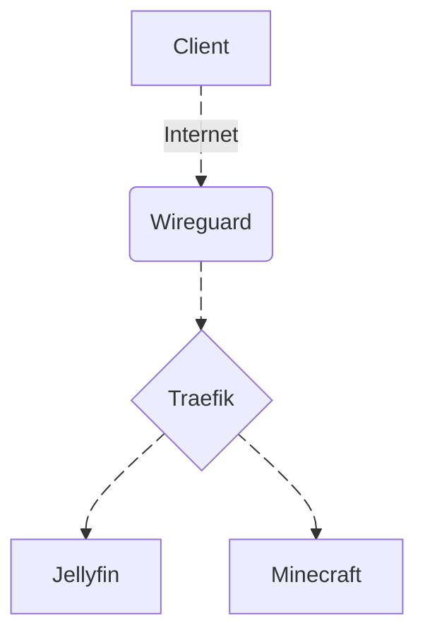
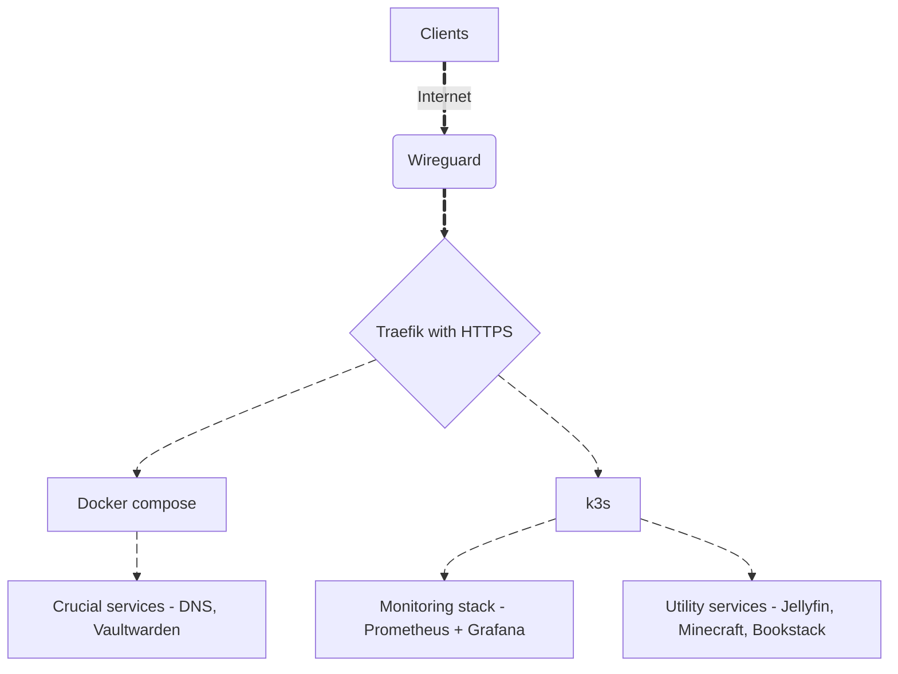

# Purpose
Repository to track and document project of migrating homeserver services to kubernetes (k3s)

# Overview
#### Initial setup

### Intro

I have decided to improve my infrastructure by migrating some of it to the production-like environment. At first, everything was running on docker compose - which yes, is sufficient for home networks, but it does not allow for using helm charts, creating clearer observability with tools such as Prometheus + Grafana, future transition to multi-node setup and familiarizing with patterns that reflect production Kubernetes environments. 

Important to note that I did not move all of the infrastructure, mainly the critical parts - Pihole + Unbound as DNS, Wireguard as a VPN and Traefik to route all, services stay on the docker-compose (At least at this time).

Firstly I backed up all of the persistent data I would like stored (while Kubernetes itself might not delete it, I could - always better safe then sorry).

### Kubernetes 

I created the git repository on github (this one) to track all of the changes and installed k3s - lightweight distribution of kubernetes more suitable for such environments as mine.

To make things easier I copied the k3s config to ~/.kube so sudo would not be necessary every time.

And with that checking 'kubectl get nodes' to see everything working properly.

### Jellyfin 

Jellyfin is an open-source media managment solution. I decided Jellyfin is going to be the first one to migrate to k3s. 

Here I was first exposed to concepts such as pv/pvc so I adpted my existing docker compose configuration to match k3s's logic. While doing that I had an issue with file location, because in docker compose the /media subdirectories were mounted using volume bind so /media/music became /music inside of the container. When the config has been copied and in k3s /media has been set as one persistent volume, issues occurred since the pod has been searching for /music. Quick comparison with 
`docker exec -it` and `kubectl exex -it <pod> -- sh`
respectively helped to pinpoint the issue and change to desired paths.

### Two Traefiks issue 
Since k3s comes with Traefik by default and I happened to use Traefik myself in docker-compose, like I mentioned in the beginning, they both started fighting for ports 80 and 443. 

That was a pretty big problem for me since I wanted to run services on both docker-compose and k3s and having to choose between both was not really an option. I didn't want to lose the easy domain routing for the critical docker-compose services, but just as much did not like the idea of setting up all k3s services with only the local IPs exposed - it wouldn't look very professional and stable if I told somebody that they can connect to my Jellyfin, just need to put http://192.168.0.9:8096 in the browser. It has been quite a hassle, I've been even thinking about running two Traefiks simultaneously for each, but quickly came to the conclusion that that is largely impractical.

 Luckily I found out that one Traefik can in fact route services that are exposed by the other part of the infrastructure. After that realization I quickly disabled the k3s's built-in Traefik in favor of already set up docker-compose one. With this approach I do need to set up Traefik routers for each of kubernetes services for it to work as intended, but honestly I would be doing that just with labels anyway so it is not such a problem for me personally and I have resolved this longstantding issue.

### Minecraft
The next thing I did was migrating a minecraft server (Cannot have a real homelab without one of those, right?). This one went similarly to jellyfin, without bigger issues.

 I did however make one more change to it in a later commit - at first I exposed it via containerPort + nodePort, but I decided to change it to the hostPort instead. The reason for that is convinience - at first it has been exposed on nodePort:30002 via a service which meant that anyone that would like connecting, would have to type in <nodeIP>:30002 which can get quite lengthy. Here comes the hostPort, by exposing the container on the default minecraft port on the host, now I could use a more convinient and prettier domain, like minecraft.local pointing to the hostIp with no need of specyfing ports. 

I am aware that it binds the deployment to this node specifically, but since it is a single-node setup (for now at least), that is the most practical option.

### Bookstack 

After migration of these two services, came the moment to set up something new that would help organizing and documenting this project and all projects in the future, and for that I chose Bookstack. The setup process was similar as previous services - writing deployments, setting up pv and pvc, but here I also got to use another type of Kubernetes object - Secret. I created it so I could still upload the deployment manifest to github without an alarming secret leak (Also added the secrets to gitignore since not doing that would be counterproductive).

### Prometheus + Grafana 

Once I had a couple of services migrated/set-up and usable I wanted to increase the observability and control over them, therefore I created a Helm Chart with a new namespace to quickly install and manage Prometheus + Grafana stack. After everything was successfully working I added a new custom Grafana dashboard which includes basic metrics of my services in readable format.

 Naturally during the initial setup, the pods were restarted a few times and I learned the hard way that the custom dashboards are not going to be retained by themselves...

This pushed me to find a solution - my 2nd custom dashboard has been exported to json and saved in a ConfigMap which is loaded alongside Grafana itself.

### Security 
The natural next step was hardening and securing the services - for that I introduced HTTPS with Traefik and Let's Encrypt as well as Vaultwarden, a (selfhosted) password manager ensuring strong and varied password for the services (and not only them).

This required changing entrypoints to websecure - port 443, setting up cert resolver in Traefik and setting up a public domain, allowing Let's Encrypt perform an acme challenge.

### Current state

This is how the server setup looks after completing this project - infrastructure is clearly divided, easier to monitor with Grafana and more secure with HTTPS certificates.

Being my private infrastructure, it is used daily and will still be developed over time. Some of the possible future improvements:
- setting up services with a privately owned domain
- moving the rest of docker compose to a specific k3s namespace
- setting up another node to learn multi-node operations